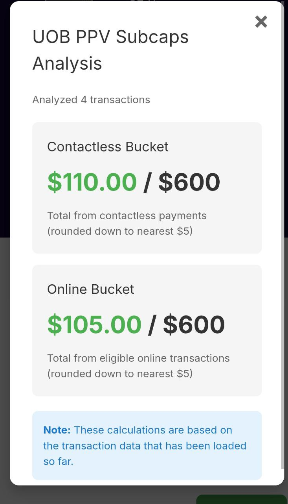
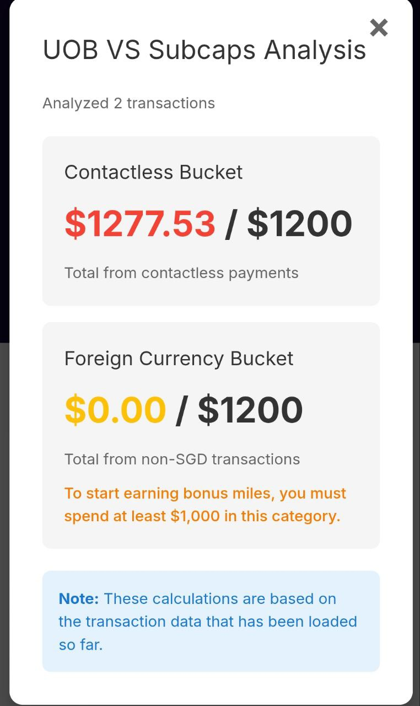

# Track Your UOB Credit Card Subcaps — Simply & Privately

If you're using UOB PPV (Preferred Platinum Visa) or UOB VS (Visa Signature) cards through HeyMax, you know how frustrating it can be to manually track your subcap spend across different categories. Are you hitting your contactless limit? Have you maxed out your online spend bucket? Nobody wants to dig through transaction lists and do mental math just to know where they stand.

**This Tampermonkey userscript solves that problem.** It automatically tracks your spending across subcap categories and shows you exactly where you are—right when you need it.

## Features

✅ **Visual Subcap Tracking**: See your spending buckets at a glance with color-coded progress indicators  
✅ **Network Request Monitoring**: Automatically intercepts transaction data from HeyMax  
✅ **Multi-Card Support**: Works with both UOB PPV and UOB VS cards  
✅ **Privacy-First**: All data stays in your browser—nothing sent to external servers  
✅ **Auto-Recovery**: Automatically re-applies patches if they are detected as overwritten  
✅ **Local Storage**: Persists data using Tampermonkey's secure GM_getValue/GM_setValue API

## 📱 Use Edge Mobile as a HeyMax App Replacement

**Don't have or want the HeyMax app?** You can use Microsoft Edge on your mobile device with this Tampermonkey script as a full replacement for the HeyMax app — with the added benefit of subcap tracking that the official app doesn't provide!

### Why Edge Mobile?
- **Tampermonkey Support**: Unlike most mobile browsers, Edge Mobile supports browser extensions including Tampermonkey
- **Same Features**: Access all HeyMax.ai website features directly in your browser
- **Plus Subcap Tracking**: This script adds subcap tracking functionality that even the official app lacks
- **Privacy**: All calculations happen locally on your device

**Note**: While Firefox Mobile and Kiwi Browser support Tampermonkey, the HeyMax.ai website doesn't work on them—it redirects users to download the app instead of loading the web interface.

### Add HeyMax to Your Homescreen
For quick access like a native app, add HeyMax to your homescreen:

**On iOS (Edge Mobile):**
1. Open https://heymax.ai in Edge
2. Tap the **Share** button (square with arrow)
3. Scroll down and tap **Add to Home Screen**
4. Name it "HeyMax" and tap **Add**

**On Android (Edge Mobile):**
1. Open https://heymax.ai in Edge
2. Tap the **menu** (three dots)
3. Tap **Add to phone** or **Add to Home screen**
4. Confirm by tapping **Add**

Now you can launch HeyMax directly from your homescreen—just like an app!

## Supported Cards

- **UOB Preferred Platinum Visa (PPV)** — both buckets have a $600 limit and transactions are rounded down to the nearest $5:
  - Tracks contactless payments
  - Tracks eligible online transactions across shopping, dining, and entertainment MCCs

- **UOB Visa Signature (VS)** — both buckets have a $1,200 limit and require spending at least $1,000 to earn bonus miles:
  - Tracks contactless payments (excluding foreign currency)
  - Tracks foreign currency transactions in any currency other than SGD

## Screenshots

The overlay uses color coding to help you understand your status instantly:
- **Green:** You're on track
- **Yellow (UOB VS only):** You haven't hit the $1,000 threshold yet to start earning bonus miles
- **Red:** You've reached or exceeded the limit for this bucket

**UOB PPV card subcaps overlay:**

**UOB VS card subcaps overlay:**

## Installation

### Edge Mobile (Recommended for Mobile Users)

**Best option for using HeyMax on your phone without the app:**

1. Install **Microsoft Edge** browser on your mobile device ([iOS](https://apps.apple.com/app/microsoft-edge/id1288723196) / [Android](https://play.google.com/store/apps/details?id=com.microsoft.emmx))
2. Open Edge, tap **≡** (menu) → **Extensions** → **Get extensions from store**
3. Search for **Tampermonkey** and install it
4. Open Tampermonkey and tap **Create a new script**
5. Delete the default template and paste the entire contents of [`src/heymax-subcaps-viewer.user.js`](src/heymax-subcaps-viewer.user.js)
6. Save the script
7. Navigate to https://heymax.ai/cards/your-cards/ and view your card details
8. Click the green "Subcaps" button that appears in the bottom-right corner

### Desktop Browsers

**Works on Chrome, Firefox, Safari, Opera, and Edge:**

1. Install [Tampermonkey](https://www.tampermonkey.net/) in your browser:
   - [Chrome/Edge](https://chrome.google.com/webstore/detail/tampermonkey/dhdgffkkebhmkfjojnmoofnopnkmjmkc)
   - [Firefox](https://addons.mozilla.org/en-US/firefox/addon/tampermonkey/) or [Greasemonkey](https://addons.mozilla.org/en-US/firefox/addon/greasemonkey/)
   - [Safari](https://apps.apple.com/app/tampermonkey/id1482490089)
   - [Opera](https://addons.opera.com/extensions/details/tampermonkey-beta/)
2. Click on the Tampermonkey icon and select "Create a new script..."
3. Delete the default template
4. Copy the entire contents of [`src/heymax-subcaps-viewer.user.js`](src/heymax-subcaps-viewer.user.js)
5. Paste it into the Tampermonkey editor and save (Ctrl+S / Cmd+S)
6. Navigate to https://heymax.ai/cards/your-cards/ and view your card details
7. Click the green "Subcaps" button that appears in the bottom-right corner

## Usage

Once installed, the script will automatically:

1. Monitor all network requests on https://heymax.ai/* pages
2. Intercept and store relevant API responses
3. Display a "Subcaps" button on supported card detail pages

### Viewing SubCaps Data

1. Navigate to a supported card detail page (e.g., https://heymax.ai/cards/your-cards/[card-id])
2. Wait for the page to load your transaction data
3. Once data is loaded, a green "Subcaps" button will appear in the bottom-right corner
4. Click the button to view your SubCaps analysis in an overlay modal

### Console Logs (For Debugging)

Open the browser console (F12 or Ctrl+Shift+I) to see:
- Network request interception logs
- API response data
- Storage operations
- Button visibility checks

## FAQ

### Why Edge Mobile instead of the HeyMax app?

Edge Mobile with this script gives you everything the HeyMax website offers, plus subcap tracking that the official app doesn't provide. It's a great alternative if you prefer browser-based access or want the additional subcap visibility.

### Will this work with other credit cards?

Not yet. The script is specifically designed for UOB PPV and UOB VS cards because they have unique subcap structures. We may add support for other cards in the future.

### What if my subcap numbers don't match what UOB shows?

The script calculates subcaps based on the transaction data visible in HeyMax. There can be slight discrepancies due to:
- Transactions that are pending or not yet synced
- Edge cases in merchant categorization
- Timing differences between HeyMax's data and UOB's systems

Use this as a helpful guide, not as your official record.

### Is this official? Is it supported by HeyMax or UOB?

No, this is an independent, open-source project. It's not affiliated with, endorsed by, or supported by HeyMax or UOB. Use it at your own discretion.

### Can I trust this with my financial data?

The code is open-source, so you can review it yourself. It doesn't send any data anywhere—everything stays in your browser. That said, you should always be cautious about what tools you install. Review the code, and if you're not comfortable, don't install it.

## Troubleshooting

**The "Subcaps" button isn't showing up:**
- Make sure you're on a card detail page (not the main card list page)
- Wait for the page to fully load transaction data (it can take a few seconds)
- Verify that your card is a UOB PPV or UOB VS card
- Check your browser console (F12 on desktop) for any error messages

**The numbers look wrong:**
- Refresh the page to reload transaction data
- Check that all your transactions have loaded (scroll down to load more if needed)
- Remember that the script only sees transactions that HeyMax has synced

**The script isn't working at all:**
- Ensure Tampermonkey is installed and enabled
- Verify the script is active in Tampermonkey's dashboard
- Verify you're on https://heymax.ai/* pages
- Try disabling other browser extensions that might conflict

**Data not persisting:**
- Tampermonkey storage is isolated per script
- Clearing browser data may not affect Tampermonkey storage
- To reset, open Tampermonkey dashboard → Storage → Delete values

**Console shows "Patches being overwritten" warnings:**
- This is normal behavior when other scripts modify fetch/XHR
- The script automatically detects and re-applies patches every second

## Security & Privacy

Your transaction data is sensitive, and this script treats it that way:

- **No external requests:** The script doesn't send any data outside your browser. Not to us, not to anyone.
- **Read-only operation:** It only intercepts and reads the transaction data that HeyMax is already loading for you. It doesn't modify anything.
- **Local storage only:** All calculations happen in your browser, and data is stored locally using Tampermonkey's secure storage.
- **Minimal permissions:** Only runs on HeyMax domain

This isn't some third-party service collecting your spending habits. It's a simple tool that works entirely on your machine, giving you visibility without compromising your privacy.

## Documentation

For developers and contributors:

- **[docs/TECHNICAL_DESIGN.md](docs/TECHNICAL_DESIGN.md)** - Comprehensive technical documentation including architecture overview, network interception details, data storage structure, SubCap calculation logic, and troubleshooting guide

## License

See [LICENSE](LICENSE) file for details.

---

**Made for UOB cardholders who just want to track their spending without the hassle.**
